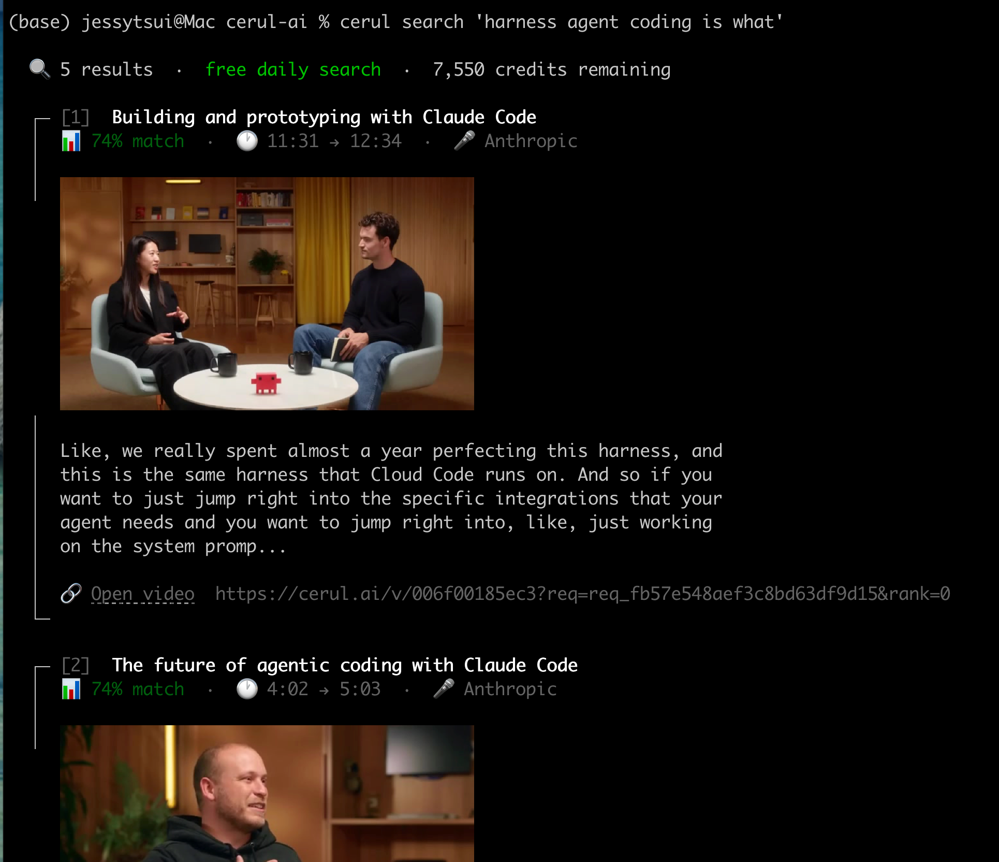

<div align="center">
  <h1>cerul</h1>
  <p><strong>The video search layer for AI agents — CLI.</strong></p>
  <p>Give any AI agent the ability to search video. Works with Claude Code, Codex, Cursor, and any tool that can run shell commands.</p>

  <p>
    <a href="https://cerul.ai/docs"><strong>Docs</strong></a> &middot;
    <a href="https://cerul.ai"><strong>Website</strong></a> &middot;
    <a href="https://github.com/cerul-ai/cerul"><strong>Main Repo</strong></a>
  </p>

  <p>
    <a href="https://github.com/cerul-ai/cerul-cli/releases/latest"></a>
    <a href="./LICENSE"></a>
    
  </p>
</div>

<br />

<div align="center">
  
</div>

<br />

## Install

```bash
curl -fsSL https://raw.githubusercontent.com/cerul-ai/cerul-cli/main/install.sh | bash
```

## Quick Start

```bash
cerul login                                 # authenticate (opens browser)
cerul search "Sam Altman on AGI timeline"   # search videos
cerul usage                                 # check credits
```

Get a free API key at [cerul.ai/dashboard](https://cerul.ai/dashboard).

## Why a CLI?

AI coding agents (Claude Code, Codex, Cursor, Cline) can run shell commands. Give them access to `cerul search` and they can find evidence from video — who said what, when, in which talk.

```bash
# An agent can run this directly
cerul search "Jensen Huang on AI infrastructure" --json

# Or as part of a multi-step research workflow
cerul search "scaling laws explained" --speaker "Ilya Sutskever" --json
cerul search "scaling laws criticism" --json
```

Use `--json` for structured output that agents can parse. Without `--json`, results are formatted for humans with inline video frames, clickable links, and color.

## Search Options

```bash
cerul search "query"                          # basic search
cerul search "query" --max-results 10         # more results (1-50)
cerul search "query" --ranking-mode rerank    # LLM reranking
cerul search "query" --include-answer         # AI summary (2 credits)
cerul search "query" --speaker "Sam Altman"   # filter by speaker
cerul search "query" --published-after 2025-01-01
cerul search "query" --source youtube
cerul search "query" --json                   # raw JSON for scripts/agents
```

## All Commands

| Command | Description |
|---------|-------------|
| `cerul search <query>` | Search indexed videos |
| `cerul usage` | Check credits and rate limits |
| `cerul login` / `logout` | Authenticate |
| `cerul config` | Interactive settings (↑↓←→ to navigate) |
| `cerul history` | Browse and re-run past searches |
| `cerul upgrade` | Self-update to latest version |
| `cerul completions <shell>` | Shell completions (bash/zsh/fish) |

## Agent Integration

Add this to your agent's skill or system prompt:

```
When the user asks about video content, talks, or what someone said
in a presentation, use the cerul CLI:

  cerul search "<query>" --json

Parse the JSON results and cite sources with timestamps and URLs.
```

Or use the [Cerul SKILL.md](https://github.com/cerul-ai/cerul/tree/main/skills/cerul) for automatic agent integration.

## Links

- [Python SDK](https://pypi.org/project/cerul/) — `pip install cerul`
- [TypeScript SDK](https://www.npmjs.com/package/cerul) — `npm install cerul`
- [Main repo](https://github.com/cerul-ai/cerul) — API, docs, skills, remote MCP

## License

[MIT](./LICENSE)
